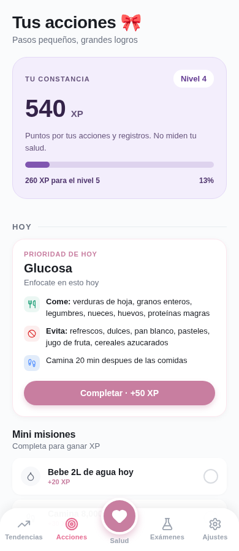
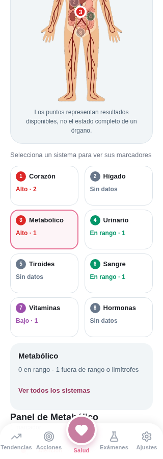

# Revisión de puntos e indicadores

7 de octubre de 2026. Revisión con datos ficticios en navegador, a anchos de
320, 390 y 1280 píxeles. Se conservaron los cambios previos del modo local y PDF.

## Presentación

- Tarjeta de XP al inicio de Acciones: total acumulado, nivel, progreso real,
  puntos faltantes y estado de nivel máximo. Cero XP produce una barra vacía.
  El texto aclara que registra actividad, no salud.
- Mapa con puntos numerados y tarjetas seleccionables de tamaño legible.
  Las tarjetas indican estado por texto y color, cantidad de marcadores y
  selección accesible. Se corrigieron las coordenadas de corazón, hígado y riñón
  sobre la ilustración original. Los sistemas distribuidos son esquemáticos.
- El grupo que contiene PSA y análisis de orina se llama «Renal y urinario»,
  evitando presentar todos esos resultados como mediciones exclusivas del riñón.
- Resumen de resultados con explicación del índice existente: promedio de
  normal=100, limítrofe=65 y alto/bajo=25. El dato se calcula desde los registros,
  evitando mostrar un puntaje persistido desactualizado. No es una escala clínica validada.
- El detalle del marcador muestra categorías y rango informado. Se retiró el
  punto que antes se posicionaba en una barra según el estado, sin calcular su
  ubicación real a partir del valor.

## Correcciones funcionales

- Comparación exacta de nombres normalizados y alias explícitos: HbA1c no se
  confunde con hemoglobina, microalbúmina con albúmina, ni orina con sangre.
  Nombres no reconocidos no se asignan a un sistema por coincidencia parcial.
- Cobertura cuenta marcadores distintos, no cada alias repetido; explica que
  el catálogo no es una recomendación de completar todos los análisis.
- Variación de puntaje solo para paneles con los mismos marcadores y unidades.
  La gráfica no añade puntos futuros inventados. Cada examen puede tener un
  panel diferente y su puntaje no constituye por sí solo una tendencia clínica.
- Tendencias numéricas excluyen límites como «< 5», evitan mezclar unidades y
  conservan signos negativos. Se corrigió la dirección de las mejoras: bajar
  desde alto hacia normal y subir desde bajo hacia normal.
- Misiones diarias usan la fecha local. La misma misión no concede XP dos veces.
  El reto semanal local se reinicia al cambiar la semana (lunes) y se limita
  a tres registros. Los contadores antiguos sin una semana identificable se
  reinician; no se reconstruye un historial que no existe.
- La racha aumenta por semanas consecutivas, no por cada día de visita. Los
  valores de racha heredados se conservan como punto de partida; no se puede
  auditar retrospectivamente su exactitud sin un historial de actividad.
- El nivel máximo muestra su estado, sin un denominador de cero; valores de XP
  negativos o no finitos no producen barras inválidas.

- Logros de sistemas usan la misma clasificación que el mapa e incluyen todos
  los marcadores registrados del sistema. Sus textos describen registros en
  rango, no salud clínica del órgano. El logro de tres exámenes ya no afirma
  que fueron chequeos trimestrales.

## Validación

- Suite completa de 38 pruebas aprobada (PDF local, persistencia, puntos,
  indicadores, configuración y pantallas existentes).
- Comprobación adicional de selección tanto desde tarjetas como desde los
  puntos del cuerpo a 320 y 1280 píxeles.
- TypeScript y exportaciones JavaScript web, Android e iOS. No equivale a
  pruebas en dispositivo nativo.

## Capturas

Antes y después del resumen:

## Límites

Las verificaciones comprueban cálculos, selección y persistencia local, no
validez clínica. Un punto verde significa que los marcadores disponibles de
ese sistema están registrados en rango; no diagnostica un órgano sano ni
indica que el sistema esté completamente estudiado. La antigüedad de los
resultados se consulta en el historial; el mapa no descarta análisis antiguos.

La sincronización y reconciliación de XP con Supabase, dispositivos nativos y
lector de pantalla real siguen requiriendo validación propia. La revisión web
comprueba roles, estados y etiquetas accesibles, pero no reemplaza esa prueba.
