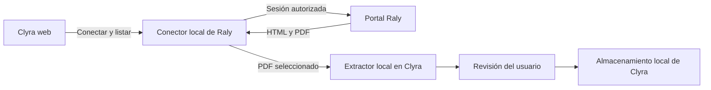

# Integración con Raly: hallazgos y alcance

Investigación del 7 de octubre de 2026. Fuentes: página pública de Raly,
sitio público de EEM SYSTEM y capturas del portal autenticado proporcionadas
por el usuario. No se copiaron cookies ni claves de los enlaces.

## Flujo observado

| Paso | Ruta | Evidencia |
| --- | --- | --- |
| Acceso de pacientes | `https://laboratorioraly.com/labeemapp/pacientesresultados` | Página pública con formulario de usuario y contraseña. |
| Inicio de sesión | `POST /labeemapp/hacerloginpac` | Acción del formulario público. No se ejecutó un login desde Clyra. |
| Listado | `/labeemapp/pacientesresultados?fnt=resultados` | La captura de la respuesta muestra HTML con fechas, nombres, estados y enlaces de descarga. |
| Informe | `GET /labeemapp/pacientesresultados?fnt=resultadopdf&…` | La captura de Network muestra `200 OK`, `Content-Type: application/pdf` y `Content-Disposition: inline`. |

Los enlaces de informe contienen parámetros `cadena`, `bloqueid` y `skey`.
Sus valores son sensibles y no deben registrarse ni incorporarse a fixtures.
La solicitud capturada incluye cookies; esto no demuestra por sí solo cuáles
son necesarias. No se verificaron caducidad, renovación o portabilidad de enlaces.

El proveedor es [EEM SYSTEM / LabEEM](https://eemsystems.com/labeem.html).
Su página menciona HL7/ASTM para analizadores de laboratorio. Eso no confirma
una API pública de acceso a resultados de pacientes. No se encontró documentación
de dicha API en las páginas revisadas; no se afirma que no exista.

## Implementación local

El trabajo actual implementa la lectura de un PDF elegido por el usuario,
con revisión antes de guardar. No equivale a sincronización con Raly.
Consultar `LOCAL_DEVELOPMENT.md` para soporte real por plataforma, formatos y pruebas.

## Validación pendiente para un conector automático

- Establecer una sesión autorizada con una cuenta de prueba o acceso delegado.
- Confirmar el manejo de cookies, redirecciones, sesión caducada y posibles controles adicionales.
- Leer solamente los informes accesibles a esa sesión, siguiendo los enlaces
  que devuelve el listado, sin construir o recorrer identificadores ajenos.
- Verificar formato, fecha y duplicados antes de importar; conservar revisión humana.
- Evaluar si Raly/EEM ofrece una integración soportada y sus condiciones de uso.
- Probar cierre de sesión y evitar persistencia de contraseñas, cookies o URLs
  sensibles en registros y almacenamiento ordinario de la aplicación.

Un conector basado en HTML depende de la estructura del portal y puede requerir
actualizaciones cuando el proveedor cambie sus páginas. Un iframe o enlace al
portal, por sí solo, no permite a Clyra leer su sesión o descargar sus resultados.

## Plan de integración (9 de octubre de 2026)

Este flujo es una propuesta pendiente de implementación. La importación manual
del PDF en web sí está disponible. No hay un conector automático operativo.

### Experiencia del usuario

1. Abrir **Exámenes → Conectar laboratorio → Raly** y ver qué datos se importarán.
2. Iniciar sesión mediante el mecanismo soportado por Raly. Si no existe acceso
   delegado, validar primero el formulario y la sesión con una cuenta autorizada.
   Las credenciales se introducen en la interfaz de conexión, nunca en el chat.
3. Mostrar el listado de estudios accesibles a esa cuenta: fecha, examen, estado
   e indicador de importado. Los dependientes requieren selección explícita para
   no mezclar resultados de distintas personas.
4. Seleccionar estudios y descargar sus PDF a través del conector.
5. Reutilizar la extracción local y la pantalla de revisión: valores, unidades,
   rangos y fecha. Diferenciar fecha de emisión de fecha de toma de muestra.
   Mostrar filas omitidas/no soportadas y conservar la entrada manual.
6. Guardar únicamente después de confirmar. Evitar duplicados y conservar el
   orden histórico, sin sustituir un resultado más reciente por uno antiguo.
7. Ofrecer **Actualizar estudios** y **Desconectar**. Al caducar la sesión,
   solicitar reconexión; al desconectar, eliminar la sesión del conector.

### Arquitectura inicial, sin Supabase

El conector sería un pequeño servicio local Node. Evita depender de que el portal
permita solicitudes entre orígenes desde el navegador. Escucharía solo en loopback,
con validación de origen y autenticación de la aplicación local; no sería un proxy
abierto. Si se ejecuta en cloud, necesitará HTTPS, autenticación y aislamiento por
usuario antes de ser expuesto. El modo inicial no necesita una base de datos de
servidor: la sesión vive en memoria y los resultados revisados en el almacenamiento
actual del app. Una futura sincronización persistente necesita diseño adicional.

El adaptador tendría operaciones `connect`, `listStudies`, `downloadStudy` y
`disconnect`. Entregaría a Clyra identificadores opacos de estudios; mantendría las
cookies y URLs firmadas dentro del conector. Solo seguiría enlaces del listado de
la sesión activa, validando dominio y redirecciones. No recorrería identificadores
ni aceptaría URLs arbitrarias. Contraseñas, cookies, claves de descarga y contenido
clínico quedarían fuera de logs, Git y telemetría. Limitar tamaño, tiempo y cantidad
de descargas; validar el PDF antes de extraerlo y liberar los bytes después.

### Orden de implementación y pruebas

1. Consultar si Raly/EEM ofrece API o acceso delegado soportado. No se ha confirmado
   OAuth ni documentación de una API de pacientes. Si no existe, validar la opción
   de usar su portal y las condiciones aplicables.
2. Probar el login autorizado y documentar campos, tokens, redirecciones, cookies,
   cierre y caducidad. Si hay CAPTCHA/MFA, prever interacción del usuario.
3. Crear el adaptador y pruebas con HTML/PDF sintéticos: login fallido, sesión
   caducada, listado vacío, cambio de HTML, PDF inválido y errores de red.
4. Añadir la interfaz de conexión y selección. Reutilizar `localLabParser` y la
   revisión de `import-pdf`, evitando guardar automáticamente resultados extraídos.
5. Validar con una cuenta autorizada: listado correcto, selección del paciente,
   descarga, duplicados, fecha, revisión, persistencia y desconexión. Comprobar
   aislamiento entre sesiones antes de admitir varios usuarios.
6. Mantener importación manual como alternativa. La extracción actual es web;
   móvil nativo requiere implementación y pruebas propias antes de ofrecerlo allí.

Para la prueba real necesitamos una sesión iniciada en la interfaz del conector
o un navegador de prueba accesible al entorno, con la cuenta autorizada por su
titular. Las capturas anteriores explican el protocolo, pero no proporcionan una
sesión utilizable. No hace falta compartir contraseñas o cookies por este chat.
