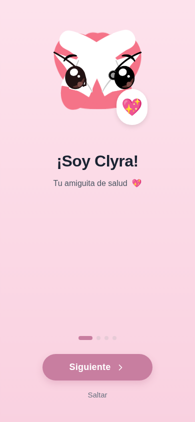
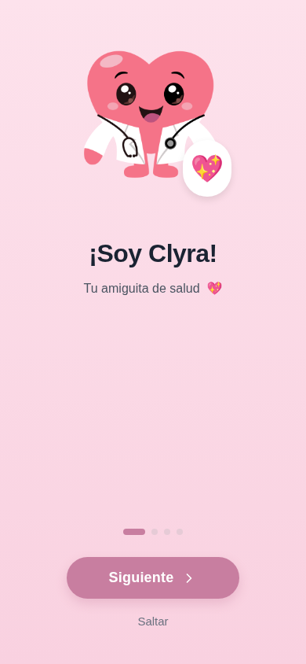
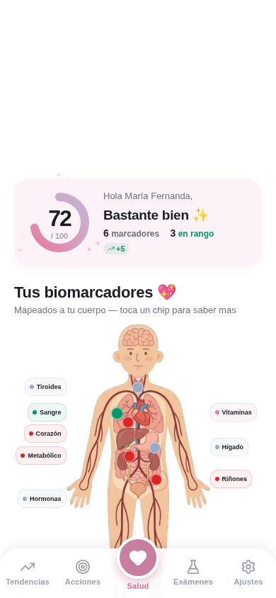
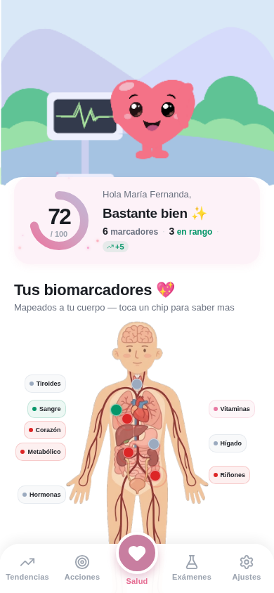
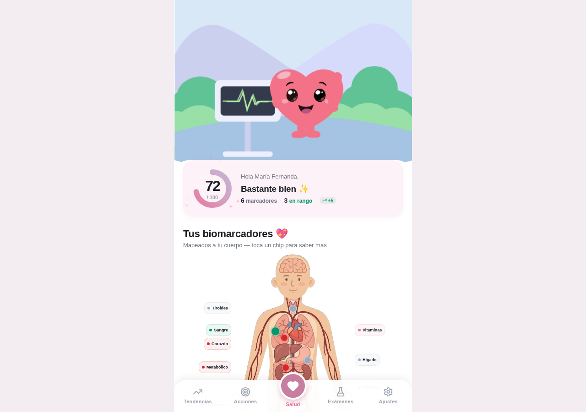

# Revisión visual de Clyra — 7 de octubre de 2026

## Evaluación

La identidad de Clyra es clara: tonos suaves, tarjetas redondeadas y una mascota cercana. El pase encontró defectos reales de composición, carga de ilustraciones, proporciones y comportamiento de controles. Se corrigieron los problemas descritos abajo conservando el diseño y los recursos originales.

El flujo local es utilizable y está cubierto por pruebas. Esto no significa que estén terminadas las integraciones remotas, las compras, las notificaciones o todas las preferencias mostradas en el prototipo.

## Cobertura visual

Se capturaron y revisaron 22 rutas/estados en Chromium a 390×844 y 1280×900: 44 recorridos, con capturas superiores e inferiores cuando había contenido desplazable. Se añadieron comprobaciones a 320×568 y muestras en inglés. Los datos de laboratorio usados son ficticios y están aislados en los contextos del navegador de revisión.

| Área | Estados recorridos |
| --- | --- |
| Bienvenida | Introducción, perfil, objetivos, preparación del perfil y acceso en modo local |
| Salud | Sin resultados y con varios biomarcadores/exámenes |
| Exámenes | Vacío, historial e ingreso manual |
| Acciones | Sin datos y con misiones/prioridades |
| Tendencias | Sin datos y con historial de tres exámenes |
| Ajustes | Perfil, idioma, controles, gestión de datos y sección legal |
| Chat | Estado local sin servicio de IA |
| Suscripción | Vista previa de planes sin compra habilitada |
| Detalle de examen | Examen existente y referencia inexistente |
| Detalle de biomarcador | Marcador existente y referencia inexistente |
| Navegación | Página no encontrada |

No hubo excepciones JavaScript en los 44 recorridos. Las capturas y los estados transitorios no sustituyen una prueba completa de cada interacción posible.

## Correcciones

| Hallazgo | Resultado |
| --- | --- |
| Mascotas con ojos, extremidades y uniforme superpuestos | Se renderizaron las ilustraciones completas desde los artboards originales; se conservan las animaciones del contenedor. |
| Hero y mascota de Acciones en blanco | WASM de Lottie servido localmente desde la dependencia bloqueada; wrapper web con tamaño explícito. No se desactivó la verificación TLS. |
| Pantallas estiradas y contenido principal fuera del primer viewport en escritorio | Marco web centrado de hasta 520 px; medidas de tarjetas, carruseles y mapa corporal adaptadas al ancho real. |
| Gráfico de tendencias desbordado en 320 px | Gráficos ajustados al espacio disponible, con prueba del límite de la tarjeta. |
| Botón del estado vacío de Acciones tapado por la navegación inferior | Contenido desplazable con espacio inferior suficiente. |
| Avisos locales sin jerarquía visual y repetidos como texto suelto | Tarjeta compartida para avisos; mensajes específicos para IA y estados vacíos. |
| Encabezado manual demasiado largo en móvil pequeño | Título corto, espacio reservado para volver y área táctil de 44 px. |
| Etiquetas de muestras en inglés dentro de pantallas españolas | Traducción de sangre, orina, heces y saliva. |
| Suscripción simulaba una compra y activaba Pro | Eliminada la simulación. Planes identificados como vista previa y compra/restauración deshabilitadas. |
| Preferencias y temas parecían funcionar sin estar conectados | Controles deshabilitados y marcados como próximos. La pantalla ya no afirma que el cifrado está activo. |
| Exportación anunciaba éxito sin crear archivo | Descarga/compartición real de JSON con perfil y exámenes; prueba del contenido descargado. |
| Confirmaciones de Ajustes no funcionaban en web | Adaptación de alertas/confirmaciones; reinicio limitado al almacenamiento de Clyra. |

## Evidencia visual

### Bienvenida: composición de la mascota

| Antes | Después |
| --- | --- |
|  |  |

### Salud: ilustración principal

| Antes | Después |
| --- | --- |
|  |  |

## Validación

- 14 pruebas automatizadas de navegador/configuración aprobadas.
- TypeScript aprobado.
- Animación comprobada con píxeles visibles en el canvas y carga local del WASM, sin solicitudes al CDN.
- Exportación JSON comprobada mediante una descarga real.
- Exportaciones JavaScript de web, Android e iOS aprobadas; no equivalen a compilar ni ejecutar las apps nativas.

Comandos reproducibles en [LOCAL_DEVELOPMENT.md](../LOCAL_DEVELOPMENT.md).

## Pendiente antes de considerar la app terminada

- Probar en iOS/Android reales: teclado, áreas seguras, cámara, selección de documentos, compartir/imprimir y animaciones nativas.
- Implementar y probar Supabase, autenticación remota, sincronización, IA y compras reales. El formulario remoto de acceso no se activó durante este pase local.
- Conectar las preferencias, los temas y las notificaciones que siguen marcados como próximos.
- Hacer una revisión específica de accesibilidad: contraste de textos secundarios pequeños, lector de pantalla, foco y escalado de texto. Este pase mejoró algunos controles, pero no certifica accesibilidad completa.
- Pulir densidad y consistencia editorial: Ajustes sigue siendo larga y algunos textos educativos son densos. El mapa anatómico tiene un estilo más clínico que la mascota; es una decisión visual pendiente, no un fallo de carga.

Los cambios permanecen en el checkout para revisión. No se publicó ni desplegó la app.
